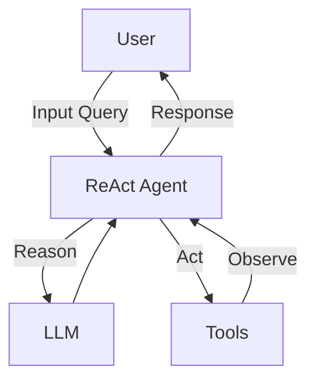

# Travel Itinerary AI Agent using Langgraph ReAct Agent
Travel Itinerary AI Agent using Langgraph's prebuilt ReAct Agent for quick prototyping.
- search_flight tool calls Google Fligts API through SERP API to fetch top 3 best flight options
- search_hotel tool calls Google Hotel API through SERP API to fetch top 3 hotels based on google ratings.



## Pre-requisites
- uv
- Python 3.12+
- langchain
- langgraph
- Update .env with SERPAPI API Key
- Update .env with GOOGLE_API_KEY (Get from https://aistudio.google.com/apikey)

## To Test in Terminal
```
uv sync
uv run app.py

Enter your message: Plan a trip from London to Paris
```
